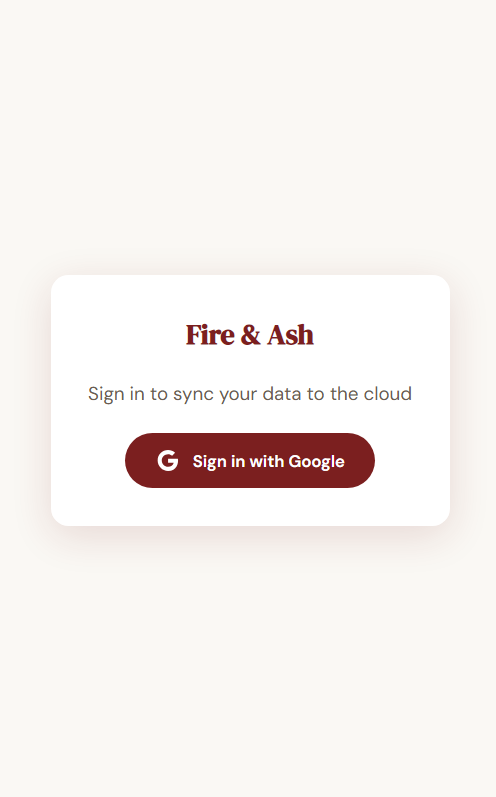
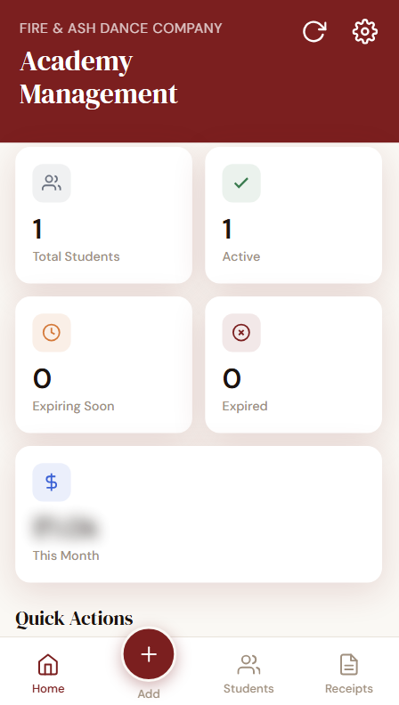
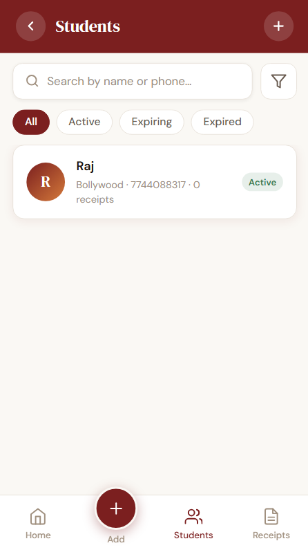

# Dance Academy Management System

A full-stack web application developed for a dance academy to manage students, registrations, and payment receipts.

⚠️ Note:  
This repository contains a **project case study only**.  
The full source code is private due to **client confidentiality**.

---

## Overview

The Dance Academy Management System is a web platform designed to help dance academies manage their daily operations efficiently.  

It allows administrators to handle student registrations, generate payment receipts, and manage academy data through a secure dashboard.

The application is currently **deployed and actively used by the academy**.

---

## Key Features

Authentication System  
- Secure login for administrators

Student Management  
- Add and manage student records  
- Maintain student enrollment data

Receipt Generation  
- Generate payment receipts  
- Maintain payment records

Dashboard  
- Central dashboard for academy management

Progressive Web App (PWA)  
- Installable web application  
- Offline support using Service Workers

---

## Tech Stack

Frontend
- HTML
- CSS
- JavaScript

Backend
- Node.js
- REST APIs

Database
- SQL / MongoDB

Other Technologies
- Progressive Web App (PWA)
- Web App Manifest
- Service Workers
- Git & GitHub

---

## Screenshots

Login Page

Dashboard

Student Management

Receipt Generation

---

## Architecture

Client (Browser)
↓
Frontend (HTML, CSS, JavaScript)
↓
Backend (Node.js REST APIs)
↓
Database (Student and payment data)

---

## PWA Support

The application supports Progressive Web App functionality through:

- Web App Manifest
- Service Worker caching
- Installable mobile experience
- Offline capability

---

## Deployment

The system is currently deployed and used internally by the academy.

Due to client privacy, the production URL and source code are not publicly shared.

---

## Project Type

Client Project – Production Use

---

## Author

Rajvardhan Wakharade  
Computer Science Engineering Student  
Full Stack Developer (Learning)
